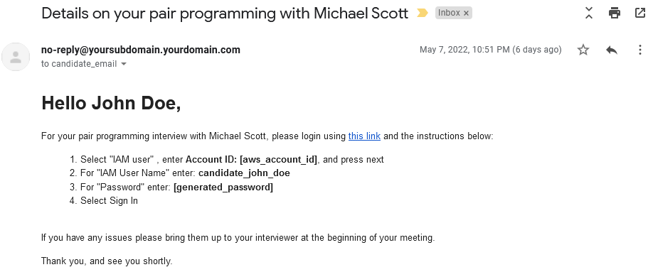
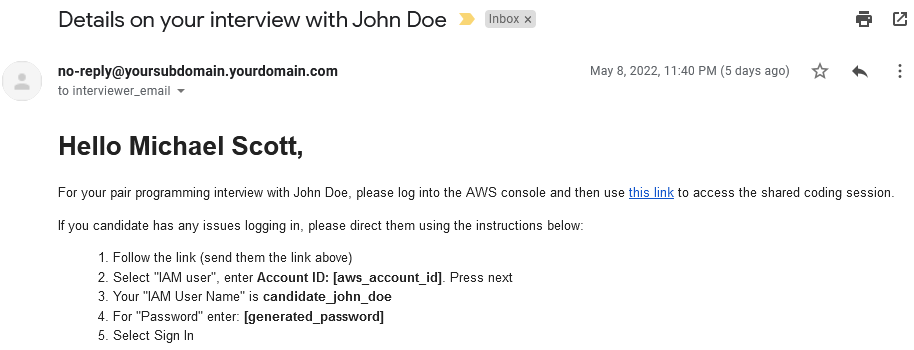

# CoderLeaf
An open source alternative to online coding interview tools using AWS Cloud9.

## Basic Usage - ([example config](examples/basicUsage.tf))
Pass the candidate's name to this Terraform module, then `terraform apply`. A new Cloud9 instance will be created alongside a unique IAM User which only has permissions to access Cloud9.

```
module "interviews" {
  source = "git@github.com:jbarna/CoderLeaf.git?ref=basic"
  candidates = {
    "John Doe" = {                              # Candidate Name
      interviewers = {
        "Michael Scott" = {                     # Interviewer Name
          arn = "michael_scott_iam_user_arn"    # Interviewer ARN
}}}}}
```

The module will provide the following output, which must be relayed to the candidate manually.
```
candidates = {
  "John Doe" = {
    "candidate_iam_user_name" = "candidate_john_doe"
    "candidate_iam_user_password" = "PLAINTEXT_PASSWORD" <== Randomly generated password
    "cloud9_url" = "https://<REGION>.console.aws.amazon.com/cloud9/ide/<CLOUD9_ID>"
  }
}
```

## Automatically Email Login Instructions - ([example config](examples/withEmail.tf))
If you prefer to have the login information sent automatically to the candidate and interviewers, CoderLeaf has the ability to send these via email by utilizing Amazon SES. 

> *This requires Amazon SES resources to have been previously created (AWS account [removed from SES sandbox](https://docs.aws.amazon.com/ses/latest/dg/request-production-access.html), your domain name [setup with DKIM records / verified identity](https://www.mailslurp.com/blog/transactional-emails-with-aws-terraform-lambda/)).*

### Default Candidate emails


### Default Interviewer emails

### Email Configuration
- `source (required)` - The source must refer to the `withEmail` branch: `git@github.com:jbarna/CoderLeaf.git?ref=withEmail`
- `fromEmail (required)` - The email address that Coderleaf will send emails from
- `ses_region (optional if aws.ses is default)` - The AWS region to send emails from
- `aws.ses provider (required)` - An AWS provider which is used to create the email templates in the correct AWS region
- `candidate_email_template_name (optional)` - The name of a pre-existing SES email template to use for the outgoing candidate email.
- `interviewer_email_template_name (optional)` - The name of a pre-existing SES email template to use for the outgoing interviewers email.

### Email Template Variables
If you want Coderleaf to send customized emails to your candidates and interviewers, you can create SES templates. These templates must satisfy the following requiresments:
- `aws_region` - The templates must be created in the same AWS region that is specified to the module through `ses_region`
- `template_variables`: The SES template must have the following named variables:
- - `candidate_name` | `interviewer_name` | `cloud9_url`
- - `iam_user_password` | `account_id` | `iam_user_name`


## Creating a Shared Terminal
Terminal executions are not sharable to others in the Cloud9 session, making it difficult for the interviewer to view what the candidate is receiving from the program as they execute their code. The terminal also removes the output from previous executions, making it difficult for the candidate to view previous executions.

These issues can be solved by instead running the program through [this bash script](utilities/run.sh), which saves all output to `out.log`.

```bash
#!/bin/bash

command="node js/index.js" # <== Change this
log_file="./out.log"
timestamp=$(TZ=EST date +%T_%Z)

echo "" >> $log_file
echo "============================ $timestamp ============================" >> $log_file

$command 2>&1 | tee -a "$log_file"

```
## AWS Credentials Disclsoure
By using this Terraform Module **you acknowledge that you understand** that this module will create access to specific Cloud9 resources in your AWS account and generates authetication credentials to those specific resources which are saved and shared in unencrypted plain text. 

If you wish to limit permissions further, please consider creating an AWS provider that is limited to only the permissions necessary for this module, and pointed to a child AWS account that contains only interviewing resources.

## License
Copyright 2022 Joel Barna

Permission is hereby granted, free of charge, to any person obtaining a copy of this software and associated documentation files (the "Software"), to deal in the Software without restriction, including without limitation the rights to use, copy, modify, merge, publish, distribute, sublicense, and/or sell copies of the Software, and to permit persons to whom the Software is furnished to do so, subject to the following conditions:

The above copyright notice and this permission notice shall be included in all copies or substantial portions of the Software.

THE SOFTWARE IS PROVIDED "AS IS", WITHOUT WARRANTY OF ANY KIND, EXPRESS OR IMPLIED, INCLUDING BUT NOT LIMITED TO THE WARRANTIES OF MERCHANTABILITY, FITNESS FOR A PARTICULAR PURPOSE AND NONINFRINGEMENT. IN NO EVENT SHALL THE AUTHORS OR COPYRIGHT HOLDERS BE LIABLE FOR ANY CLAIM, DAMAGES OR OTHER LIABILITY, WHETHER IN AN ACTION OF CONTRACT, TORT OR OTHERWISE, ARISING FROM, OUT OF OR IN CONNECTION WITH THE SOFTWARE OR THE USE OR OTHER DEALINGS IN THE SOFTWARE.